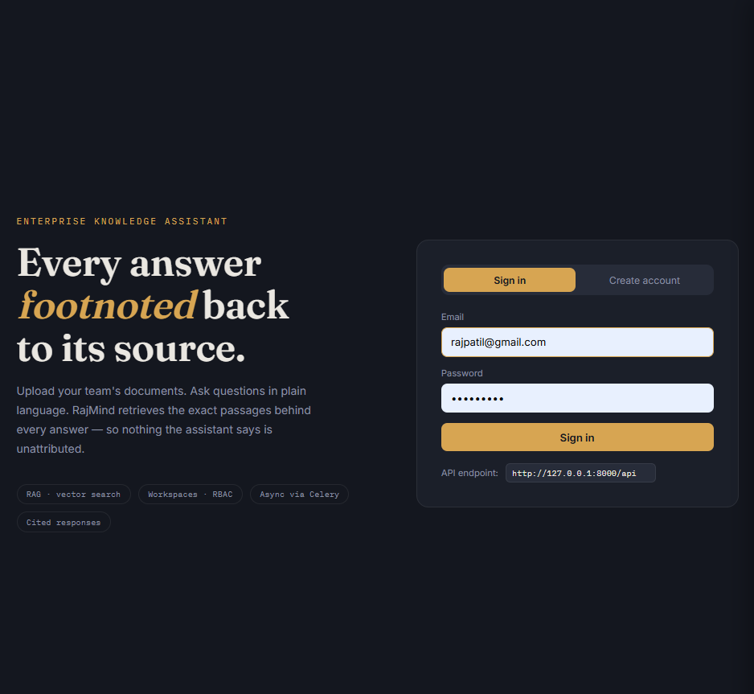
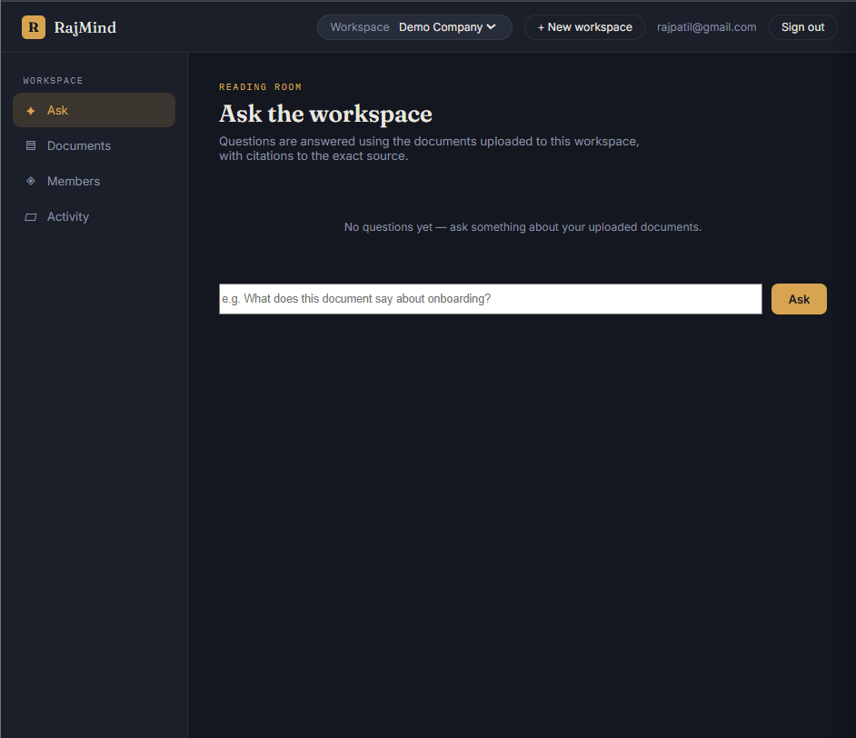
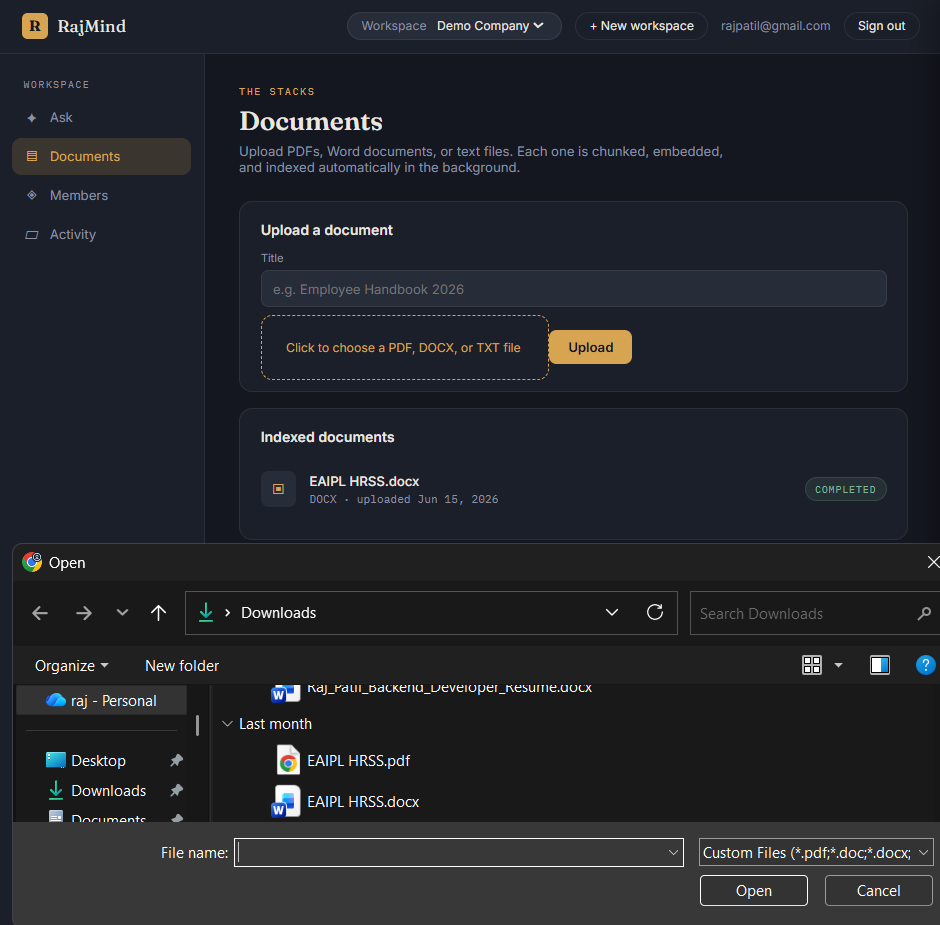
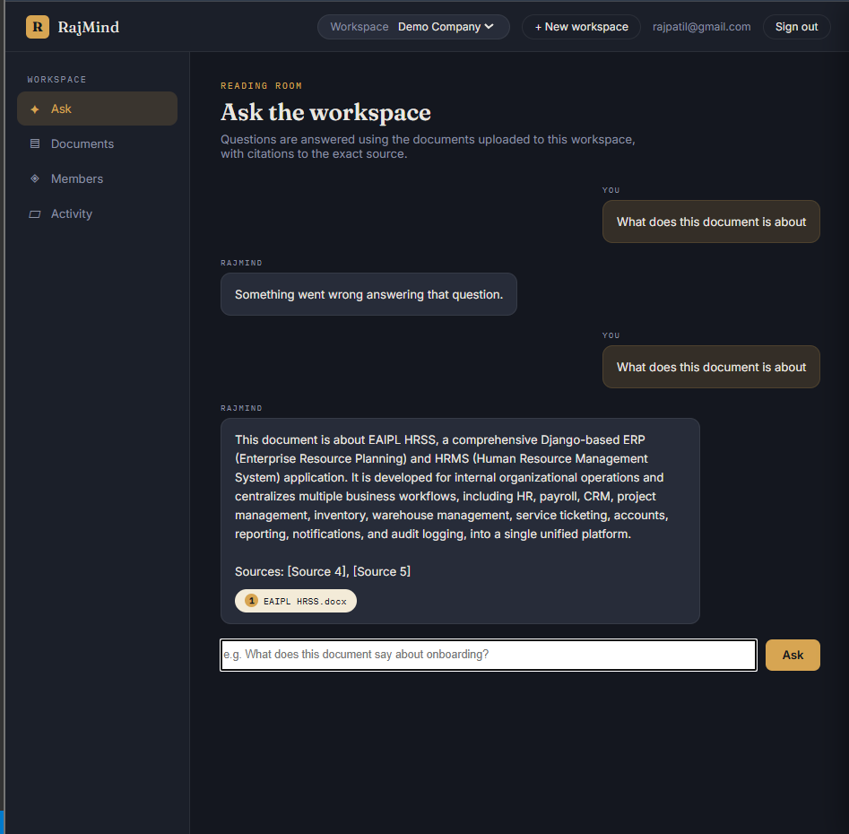
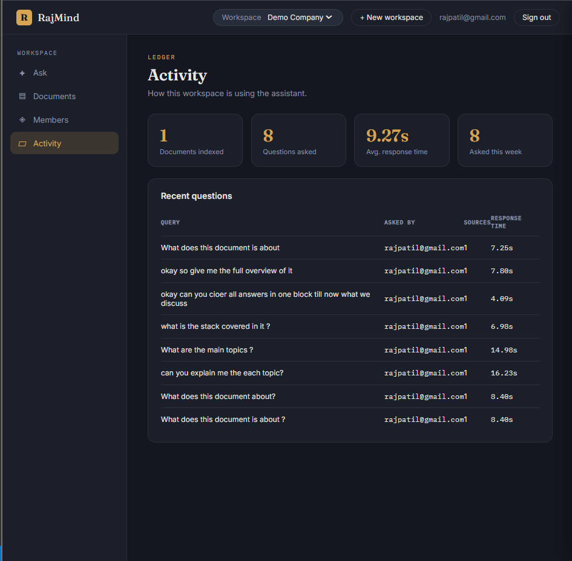

# RajMind – Enterprise AI Knowledge Assistant

A multi-tenant AI-powered knowledge platform that enables organizations to centralize company documents and retrieve information using natural language queries with source-backed answers.

---

## Problem Statement

Organizations store critical information across PDFs, SOPs, HR policies, technical documentation, onboarding guides, project reports, and internal knowledge bases.

Finding the right information often requires employees to manually search through multiple documents, resulting in wasted time and reduced productivity.

RajMind solves this problem by transforming company documents into a searchable AI knowledge system that allows users to ask questions in plain English and receive accurate answers with citations from the original documents.

---

## Key Features

### Authentication & Security

* JWT-based authentication
* Custom user model
* Protected API endpoints

### Multi-Tenant Workspace Management

* Create and manage independent workspaces
* Organization-level data isolation
* Role-Based Access Control (RBAC)

### Role Management

* Owner
* Admin
* Member
* Viewer

### Document Intelligence

* Upload PDF, DOCX, and TXT files
* Automated document processing pipeline
* Text extraction and chunking
* Vector embedding generation

### AI-Powered Knowledge Retrieval

* Retrieval-Augmented Generation (RAG)
* Semantic search using vector similarity
* Context-aware AI responses
* Source-backed answers with citations

### Conversation Management

* Multi-turn conversations
* Conversation history
* Persistent chat sessions

### Analytics Dashboard

* Search activity monitoring
* Usage insights
* Workspace analytics
* Response tracking

### Background Processing

* Celery task queue
* Redis message broker
* Asynchronous document processing

### Deployment Ready

* Dockerized architecture
* Environment-based configuration
* Scalable service-oriented design

---

## Tech Stack

| Layer            | Technology                                             |
| ---------------- | ------------------------------------------------------ |
| Backend          | Django, Django REST Framework                          |
| Database         | PostgreSQL                                             |
| Cache / Queue    | Redis                                                  |
| Background Tasks | Celery                                                 |
| Vector Database  | ChromaDB                                               |
| AI / Embeddings  | Google Gemini (gemini-2.5-flash, gemini-embedding-001) |
| Authentication   | JWT (SimpleJWT)                                        |
| Containerization | Docker, Docker Compose                                 |

---

## Architecture

```text
Client (Postman / Frontend)
        |
        v
Django REST API (web)
        |
   -----------------------------------
   |          |          |           |
   v          v          v           v
PostgreSQL  Redis     ChromaDB    Celery Worker
(database)  (broker)  (vectors)   (background tasks)
                                       |
                                       v
                                  Google Gemini API
```

---

## Application Screenshots

### Login & Authentication





### Workspace Dashboard





### Document Upload & Processing





### AI Knowledge Assistant





### Analytics Dashboard





---

## Setup

### Prerequisites

* Docker Desktop
* Google Gemini API Key

### Installation

Clone the repository:

```bash
git clone <repository-url>
cd enterprise-ai-knowledge-assistant
```

Create environment file:

```bash
cp .env.example .env
```

Configure your environment variables and Gemini API Key.

Build and start services:

```bash
docker-compose up --build
```

Run migrations:

```bash
docker-compose exec web python manage.py migrate
```

Create superuser:

```bash
docker-compose exec web python manage.py createsuperuser
```

---

## API Endpoints

| Endpoint                                    | Method   | Description                 |
| ------------------------------------------- | -------- | --------------------------- |
| `/api/auth/register/`                       | POST     | Register a new user         |
| `/api/auth/login/`                          | POST     | Login and obtain JWT tokens |
| `/api/workspaces/`                          | GET/POST | Create or list workspaces   |
| `/api/workspaces/{id}/members/add/`         | POST     | Add workspace member        |
| `/api/workspaces/{id}/documents/`           | GET/POST | Upload and manage documents |
| `/api/workspaces/{id}/chat/ask/`            | POST     | Ask AI-powered questions    |
| `/api/workspaces/{id}/analytics/dashboard/` | GET      | Workspace analytics         |

---

## Project Status

Completed and verified end-to-end:

* Authentication System
* Multi-Tenant Architecture
* RBAC Implementation
* Document Ingestion Pipeline
* Semantic Search
* Vector Database Integration
* Google Gemini Integration
* AI Chat with Citations
* Analytics Dashboard
* Celery Background Processing
* Redis Queue Management
* Dockerized Deployment
* Frontend Interface

---

## Future Improvements

* Source snippet preview
* Advanced analytics
* Team collaboration features
* Knowledge health scoring
* Document summarization
* Suggested AI prompts

---

## Author

Raj Patil

Master of Information Technology

Backend Developer | AI Applications | Django Developer
